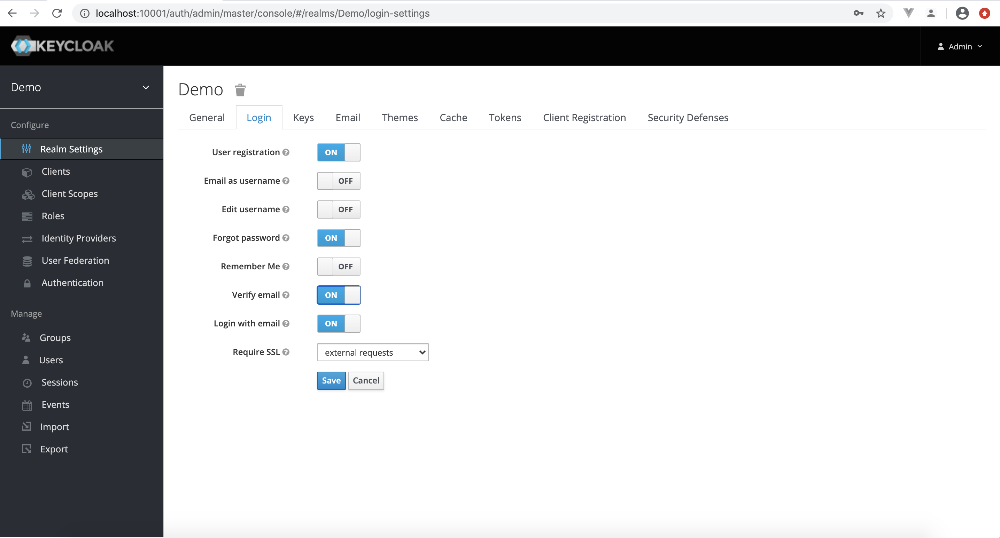
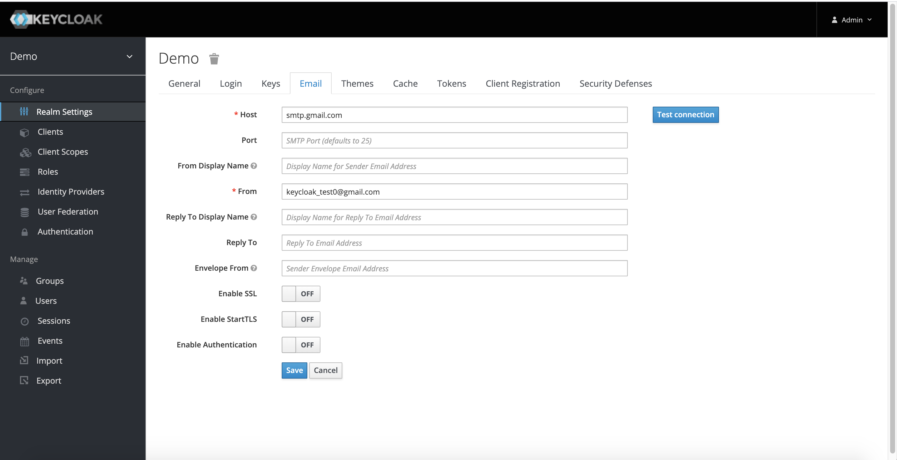
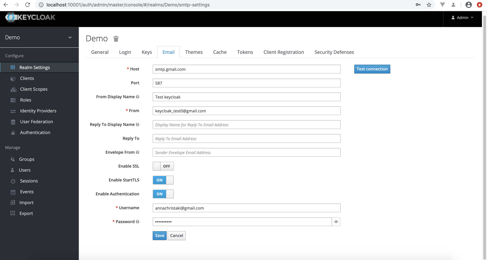
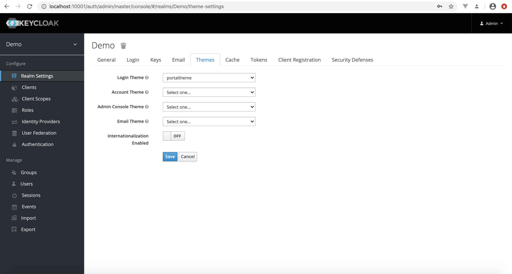
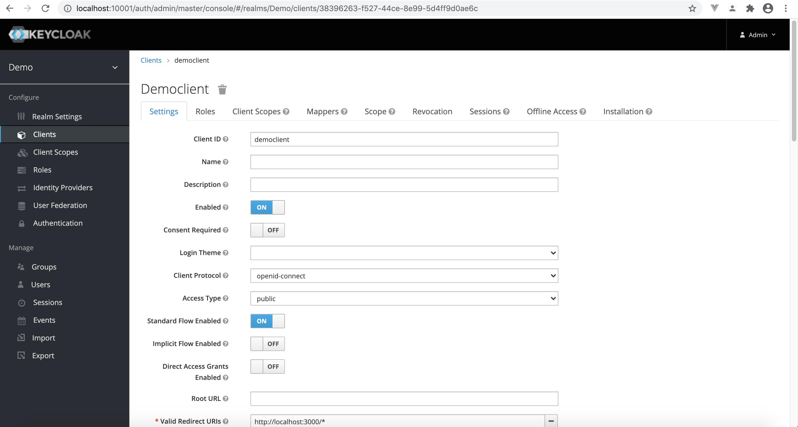
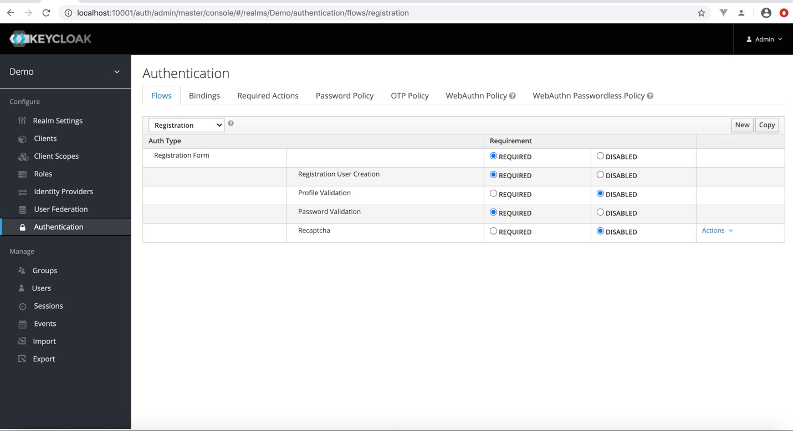

# keycloak-theme
Europeana custom Keycloak theme.


### Developer Guide

Install Sass globally

```npm install -g sass```


From project root run:

```npm install```


With Docker running do: 

```bash
# chmod +x devbuild.sh

./devbuild.sh
```

This will create a Docker Keycloak image and run a container to test the custom [theme](./theme). A [bind mount](https://docs.docker.com/storage/bind-mounts/) is used to mount the project's theme directory to the container. Caching for themes is turned off so any changes in .flt, .properties or .css files in [theme](./theme) directory can be previewed on the fly.

### Setup a Realm and Client for the new theme

Navigate to Keycloak's welcome page: ```http://localhost:10001```

Login to the Administration Console using the KEYCLOAK_USER (admin) and KEYCLOAK_PASSWORD (password) credentials.

Create a new Realm (Demo) and go to **Login** tab for the realm. Change the Login settings as shown below:



To get Email confirmation during registration *Verify Email* must be set to **ON**, admin user's email must be set (on master realm) and Email tab on new Realm should be filled in. An example setup is shown below:



This is a dummy setup to get the user to the Email verification page after registration but will not actually work by sending emails. To log in with a new user account after registration go to admin console, select the new realm, go to Users, set *Email Verified* to **ON** and delete *Verify Email* from *Required user Actions*.

Alternatively an example of a working setup is shown below:



If gmail is used, like in the above setup, you must turn off two-step authentication (for the account in *Username*) and set **Less secure app access** from Google Account Security to **ON**. A working Email setup is required to test the Reset Password flow.


Navigate to the **Themes** tab and select the custom theme as the **Login** theme:



Create a new Client (democlient) for the Realm and change settings as shown:



If the client is used from portal for Authentication Implicit Flow should be set to **ON**.

Navigate to **Authentication** and choose *Flows* tab. Select *Registration* from dropdown at the top and change *Profile Validation* from **REQUIRED** to **DISABLED**. 



This will change the default validation on User Registration and use custom validation based on the form registration fields. Log out of admin console.


Navigate to


http://localhost:10001/auth/realms/{realm_name}/account

to see the custom theme.


## Theme updates
Directory [theme](./theme) contains all the files for the custom theme. 


Images from [assets](./assets) directory were copied to: 

```
theme/login/resources
```
Directory [custom](./custom) contains the scss files used to build the theme css. Compiled css for theme can be found in [theme resources](./theme/login/resources/css)

For theme updates to the scss do:

```bash
declare -r currentDir="$(dirname "${BASH_SOURCE[0]}")"
 
sass --watch --load-path=${currentDir}/node_modules --load-path=${currentDir}/assets/scss custom/scss/style.scss:theme/login/resources/css/portallogin.css --update
```

Changes can be previewed on the fly on the keycloak url.


